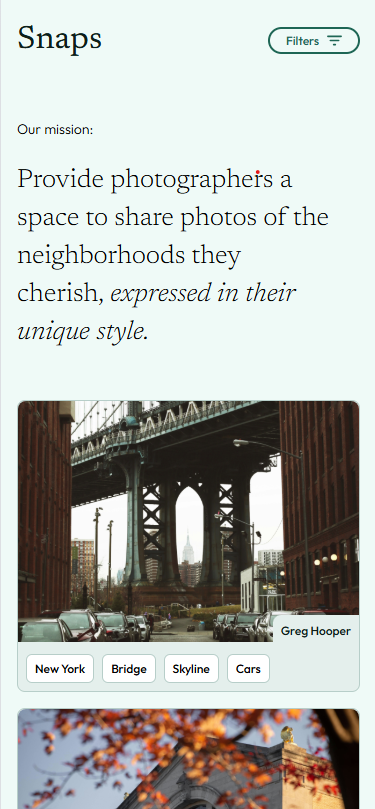
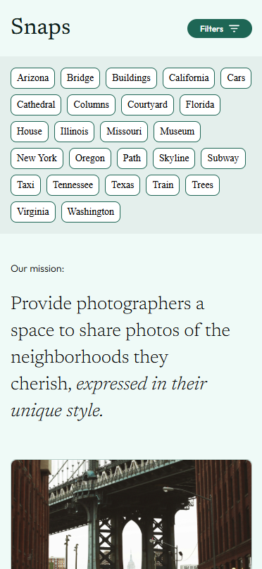
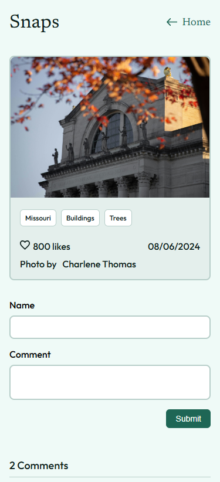

# Snaps

## Overview

A full stack, responsive app for sharing pictures.

## Features

Each photo has related tags that enables the user to filter the displayed pictures based on a tag.

The user can comment and view privious comments on each picture.

## Tech Stack

React.js and SCSS for front end
Node.js and express for back-end
MySQL and Knex.js for data base

## Screen Shots

## Mobile view

